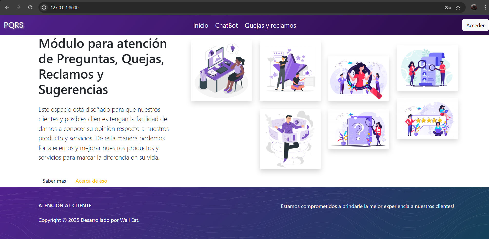
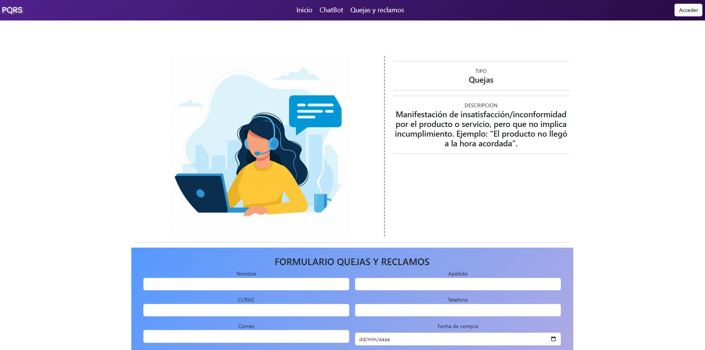
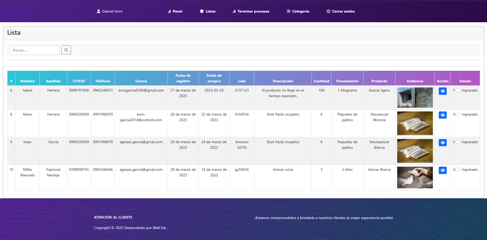
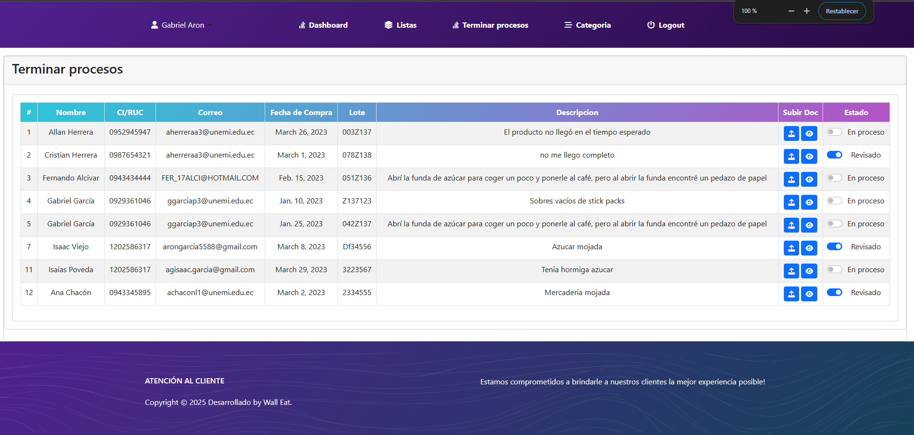
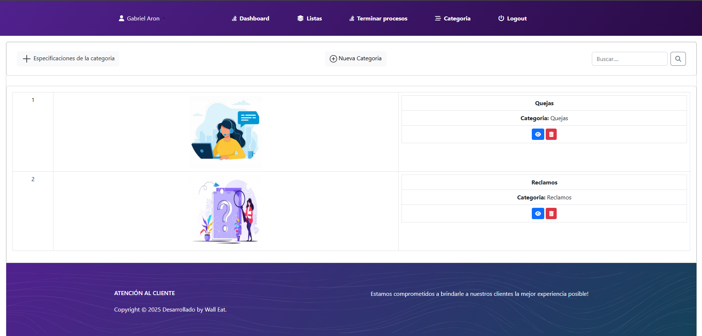

# Módulo PQRS

Sistema de gestión de Peticiones, Quejas, Reclamos y Sugerencias (PQRS) para clientes internos y externos. Este módulo permite registrar, consultar y actualizar solicitudes, con notificaciones automáticas por correo electrónico y un panel de administración tipo dashboard sin olvidar un ChatBot.

---

## 📌 Descripción

Este módulo maneja el flujo completo de atención al cliente mediante la gestión de PQRS. Está desarrollado en Django y permite registrar solicitudes, asignarles un estado, y notificar por correo a los usuarios y responsables en cada etapa del proceso.

---

## 🖼️ Vista del sistema







## ✅ Funcionalidades

- **Registro de solicitudes PQRS** por parte de usuarios internos o externos.
- **Actualización del estado de cada solicitud** (pendiente, en proceso, resuelta, etc.).
- **Notificaciones por correo electrónico** en cada cambio de estado.
- **Panel administrativo** para visualización y seguimiento.
- **Gestión centralizada de usuarios y roles** para manejo de accesos y responsabilidades.

---

## 🚀 Características

- Interfaz amigable desarrollada con Bootstrap.
- Envío de correos configurable mediante servidor SMTP.
- Diseño modular basado en Django apps.
- Código limpio y estructurado para fácil mantenimiento.
- Plantillas reutilizables con sistema de herencia (`base.html` y `base_admin.html`).

---

## ⚙️ Requisitos

- Python 3.8 o superior
- Django 4.x
- Servidor SMTP válido (por ejemplo: Gmail, SendGrid, Mailtrap)
- Gestor de paquetes `pip`
- Entorno virtual recomendado (`venv`)
- El text requirements.txt

---

## 👨‍💻 Contacto

- Nombre: Aron Garcia
- Correo: arongarcia558@gmail.com

## 🛠️ Configuración

1. Clona el repositorio:

```bash
git clone https://tu-repo.com/ModulPQRS.git
cd ModulPQRS

```
